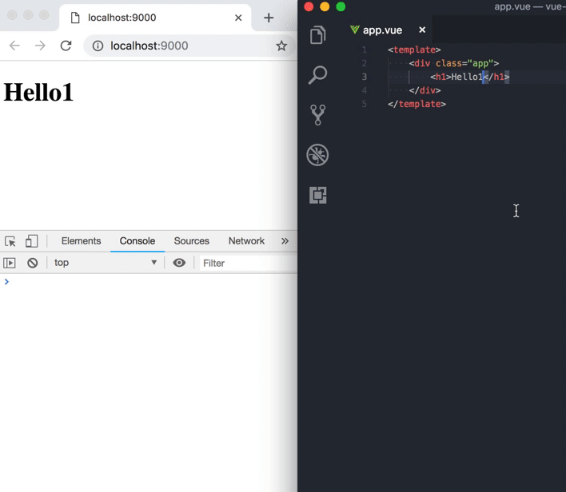

# Vue Loader 15.4 & Webpack 4.25.1 Hot Reload issue

Reproduction steps:

- `git clone`
- `npm install`
- `npm run dev`
- go to `http://localhost:9000`
- try changing `app.vue`
- observe stack overflow error in DevTools

